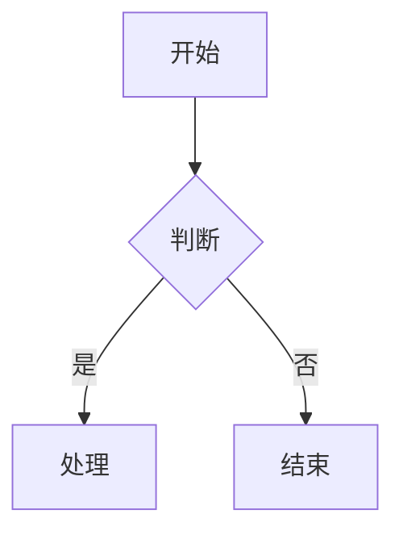
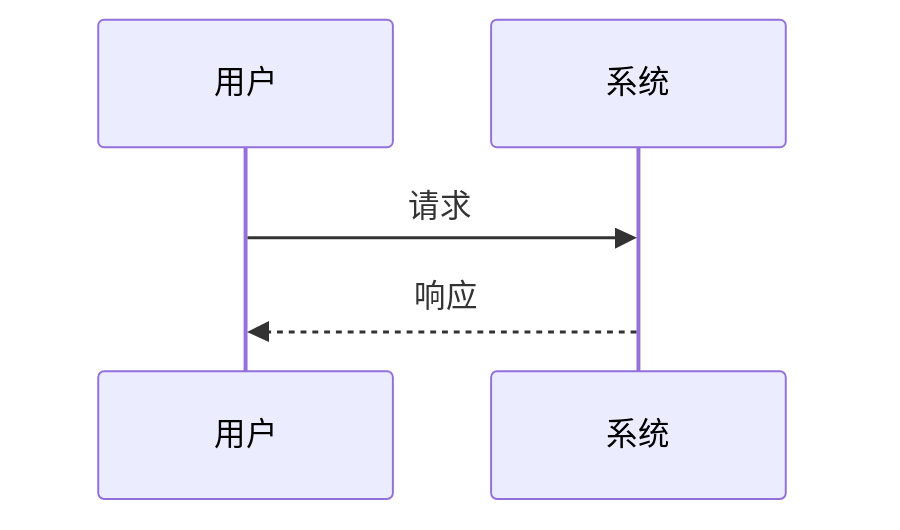
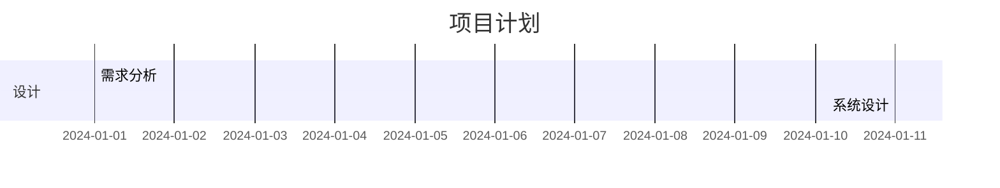
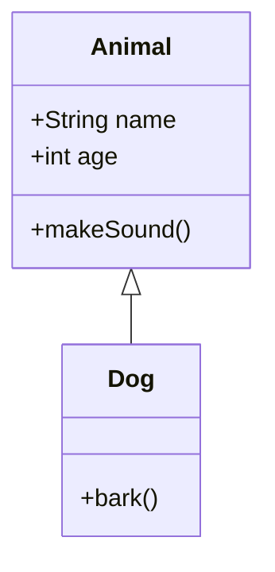
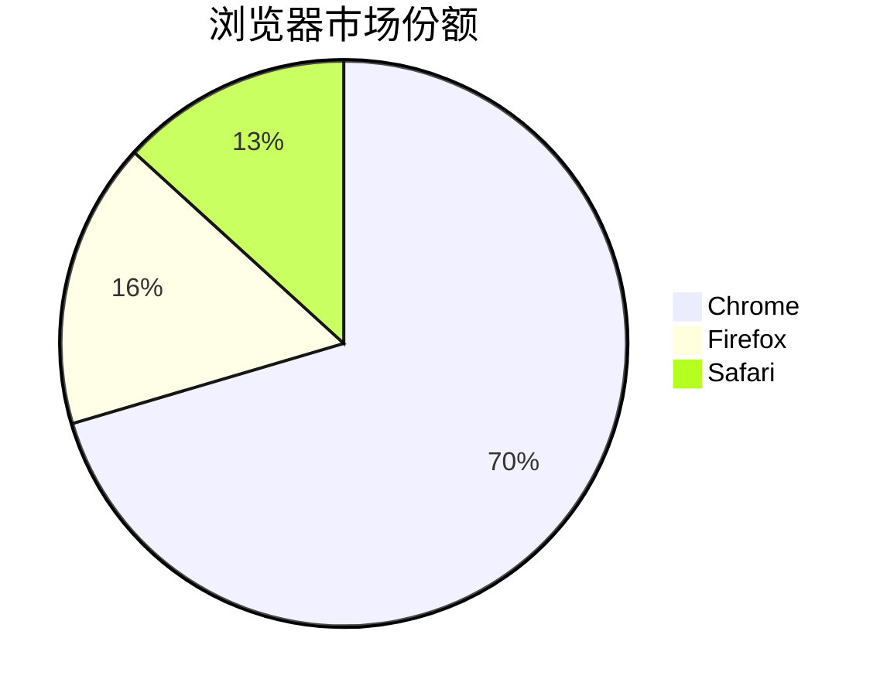
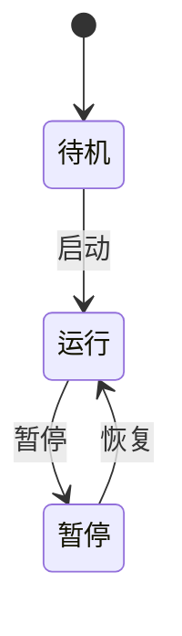

# React Markdown Mermaid

一个用于在React应用中渲染Mermaid图表的轻量级组件和rehype插件。支持在react-markdown中自动渲染Mermaid图表，提供完整的TypeScript支持。

## ✨ 特性

- 🎯 **轻量级** - 只包含必要的代码，React相关依赖作为外部依赖
- 🔧 **易于使用** - 简单的API，快速上手
- 📝 **Markdown集成** - 与react-markdown完美集成
- 🎨 **主题支持** - 支持自定义Mermaid主题和配置
- 🔄 **SSR支持** - 支持服务端渲染
- 📱 **响应式** - 自适应容器宽度
- 🛡️ **错误处理** - 完善的错误处理和加载状态
- 📦 **TypeScript** - 完整的TypeScript类型支持

## 📦 安装

```bash
npm install react-markdown-mermaid
# 或
yarn add react-markdown-mermaid
# 或
pnpm add react-markdown-mermaid
```

## 🚀 快速开始

### 1. 基本用法 - 独立组件

```tsx
import React from 'react';
import { Mermaid } from 'react-markdown-mermaid';

const App = () => {
  const chart = `
    graph TD
      A[开始] --> B{判断条件}
      B -->|是| C[处理A]
      B -->|否| D[处理B]
      C --> E[结束]
      D --> E
  `;

  return (
    <div>
      <h1>流程图示例</h1>
      <Mermaid chart={chart} />
    </div>
  );
};
```

### 2. 与 react-markdown 集成

```tsx
import React from 'react';
import ReactMarkdown from 'react-markdown';
import { rehypeMermaid, MermaidBlock } from 'react-markdown-mermaid';

const App = () => {
  const markdown = `
# 我的文档

这是一个流程图：

\`\`\`mermaid
graph TD
  A[开始] --> B{判断条件}
  B -->|是| C[处理A]
  B -->|否| D[处理B]
  C --> E[结束]
  D --> E
\`\`\`

这是一个序列图：

\`\`\`mermaid
sequenceDiagram
  participant 用户
  participant 系统
  participant 数据库
  
  用户->>系统: 登录请求
  系统->>数据库: 验证用户
  数据库-->>系统: 返回结果
  系统-->>用户: 登录响应
\`\`\`
  `;

  return (
    <ReactMarkdown
      rehypePlugins={[
        [
          rehypeMermaid,
          {
            mermaidConfig: {
              theme: 'default',
              flowchart: { useMaxWidth: true },
            },
          },
        ],
      ]}
      components={{
        MermaidBlock: MermaidBlock,
      }}
    >
      {markdown}
    </ReactMarkdown>
  );
};
```

## 📚 API 文档

### Mermaid 组件

独立的Mermaid图表组件。

#### Props

| 属性          | 类型                     | 默认值                       | 描述             |
| ------------- | ------------------------ | ---------------------------- | ---------------- |
| `chart`       | `string`                 | -                            | Mermaid图表代码  |
| `config`      | `MermaidConfig`          | -                            | Mermaid配置选项  |
| `id`          | `string`                 | 自动生成                     | 图表ID           |
| `className`   | `string`                 | `'react-markdown-mermaid'`   | CSS类名          |
| `style`       | `CSSProperties`          | -                            | 内联样式         |
| `onLoad`      | `() => void`             | -                            | 加载完成回调     |
| `onError`     | `(error: Error) => void` | -                            | 错误回调         |
| `onRender`    | `() => void`             | -                            | 渲染完成回调     |
| `showLoading` | `boolean`                | `true`                       | 是否显示加载状态 |
| `loadingText` | `string`                 | `'Loading diagram...'`       | 加载文本         |
| `errorText`   | `string`                 | `'Failed to render diagram'` | 错误文本         |
| `ssr`         | `boolean`                | `false`                      | 是否服务端渲染   |

#### 示例

```tsx
import { Mermaid } from 'react-markdown-mermaid';

<Mermaid
  chart={chartCode}
  config={{
    theme: 'dark',
    flowchart: { useMaxWidth: true },
  }}
  className="my-mermaid"
  onLoad={() => console.log('图表加载完成')}
  onError={(error) => console.error('渲染错误:', error)}
/>;
```

### MermaidBlock 组件

专门为rehype插件设计的组件。

#### Props

| 属性            | 类型            | 默认值            | 描述            |
| --------------- | --------------- | ----------------- | --------------- |
| `code`          | `string`        | -                 | Mermaid图表代码 |
| `mermaidConfig` | `any`           | -                 | Mermaid配置     |
| `ssr`           | `boolean`       | `false`           | 是否服务端渲染  |
| `className`     | `string`        | `'mermaid-block'` | CSS类名         |
| `style`         | `CSSProperties` | -                 | 内联样式        |

### rehypeMermaid 插件

用于在react-markdown中自动处理Mermaid代码块。

#### 选项

| 属性            | 类型      | 默认值  | 描述           |
| --------------- | --------- | ------- | -------------- |
| `mermaidConfig` | `any`     | -       | Mermaid配置    |
| `ssr`           | `boolean` | `false` | 是否服务端渲染 |

## 🎨 样式定制

### 导入样式

```tsx
import 'react-markdown-mermaid/style.css';
```

### 自定义样式

```css
/* 自定义Mermaid组件样式 */
.react-markdown-mermaid {
  border: 1px solid #e1e5e9;
  border-radius: 8px;
  padding: 16px;
  margin: 16px 0;
}

/* 加载状态样式 */
.react-markdown-mermaid.loading {
  background-color: #f8f9fa;
}

/* 错误状态样式 */
.react-markdown-mermaid.error {
  background-color: #f8d7da;
  color: #721c24;
}
```

## 📊 支持的图表类型

### 1. 流程图 (Flowchart)



### 2. 序列图 (Sequence Diagram)



### 3. 甘特图 (Gantt Chart)



### 4. 类图 (Class Diagram)



### 5. 饼图 (Pie Chart)



### 6. 状态图 (State Diagram)



## 🔧 高级配置

### Mermaid 配置

```tsx
const mermaidConfig = {
  theme: 'default', // 或 'dark', 'forest', 'neutral'
  flowchart: {
    useMaxWidth: true,
    htmlLabels: true,
  },
  sequence: {
    useMaxWidth: true,
    diagramMarginX: 50,
    diagramMarginY: 10,
  },
  gantt: {
    useMaxWidth: true,
  },
};
```

### 服务端渲染

```tsx
// 在服务端渲染时
<Mermaid
  chart={chartCode}
  ssr={true}
  onLoad={() => {
    // 客户端水合后执行
  }}
/>
```

### 错误处理

```tsx
<Mermaid
  chart={chartCode}
  onError={(error) => {
    console.error('Mermaid渲染错误:', error);
    // 显示友好的错误信息
  }}
  errorText="图表渲染失败，请检查语法"
/>
```

## 📝 完整示例

### 1. 基本示例

```tsx
import React from 'react';
import { Mermaid } from 'react-markdown-mermaid';
import 'react-markdown-mermaid/style.css';

const BasicExample = () => {
  const flowchart = `
    graph TD
      A[开始] --> B{判断条件}
      B -->|是| C[处理A]
      B -->|否| D[处理B]
      C --> E[结束]
      D --> E
  `;

  const sequenceDiagram = `
    sequenceDiagram
      participant 用户
      participant 系统
      participant 数据库
      
      用户->>系统: 登录请求
      系统->>数据库: 验证用户
      数据库-->>系统: 返回结果
      系统-->>用户: 登录响应
  `;

  return (
    <div>
      <h2>流程图</h2>
      <Mermaid chart={flowchart} />

      <h2>序列图</h2>
      <Mermaid chart={sequenceDiagram} />
    </div>
  );
};
```

### 2. Markdown 集成示例

```tsx
import React from 'react';
import ReactMarkdown from 'react-markdown';
import remarkGfm from 'remark-gfm';
import { rehypeMermaid, MermaidBlock } from 'react-markdown-mermaid';
import 'react-markdown-mermaid/style.css';

const MarkdownExample = () => {
  const markdown = `
# 项目文档

## 系统架构

\`\`\`mermaid
graph TD
  A[前端] --> B[API网关]
  B --> C[用户服务]
  B --> D[订单服务]
  C --> E[数据库]
  D --> E
\`\`\`

## 用户登录流程

\`\`\`mermaid
sequenceDiagram
  participant U as 用户
  participant F as 前端
  participant A as API
  participant D as 数据库
  
  U->>F: 输入用户名密码
  F->>A: 发送登录请求
  A->>D: 查询用户信息
  D-->>A: 返回用户数据
  A-->>F: 返回登录结果
  F-->>U: 显示登录状态
\`\`\`

## 项目进度

\`\`\`mermaid
gantt
  title 项目开发计划
  dateFormat YYYY-MM-DD
  section 设计阶段
  需求分析    :done, des1, 2024-01-01, 2024-01-10
  系统设计    :active, des2, 2024-01-11, 2024-01-25
  section 开发阶段
  编码实现    :dev1, 2024-01-26, 2024-02-15
  测试调试    :dev2, 2024-02-16, 2024-02-28
\`\`\`
  `;

  return (
    <ReactMarkdown
      remarkPlugins={[remarkGfm]}
      rehypePlugins={[
        [
          rehypeMermaid,
          {
            mermaidConfig: {
              theme: 'default',
              flowchart: { useMaxWidth: true },
              sequence: { useMaxWidth: true },
              gantt: { useMaxWidth: true },
            },
          },
        ],
      ]}
      components={{
        MermaidBlock: MermaidBlock,
      }}
    >
      {markdown}
    </ReactMarkdown>
  );
};
```

## 🤝 贡献

欢迎提交 Issue 和 Pull Request！

### 开发环境设置

```bash
# 克隆仓库
git clone https://github.com/your-username/react-markdown-mermaid.git
cd react-markdown-mermaid

# 安装依赖
npm install

# 启动开发服务器
npm run dev

# 构建库
npm run build
```

## 📄 许可证

MIT License

## 🔗 相关链接

- [Mermaid 官方文档](https://mermaid.js.org/)
- [React Markdown](https://github.com/remarkjs/react-markdown)
- [Rehype](https://github.com/rehypejs/rehype)

---

如果这个库对你有帮助，请给它一个 ⭐️！
