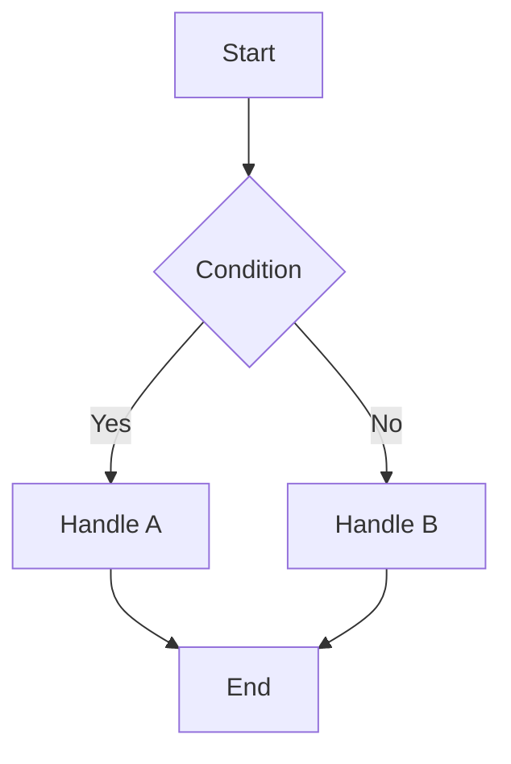
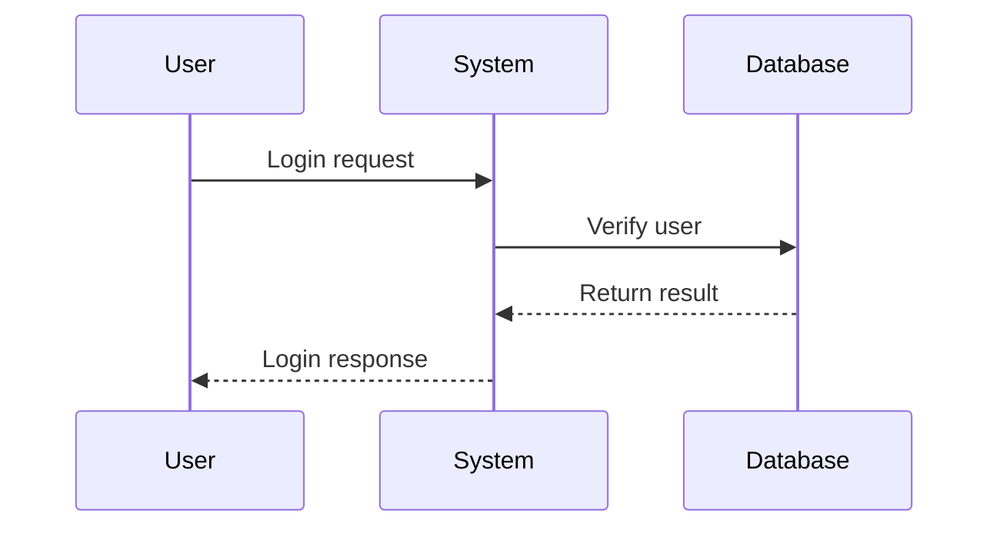
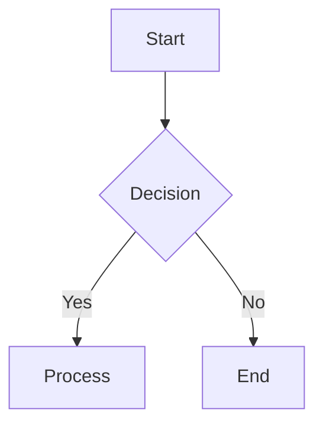
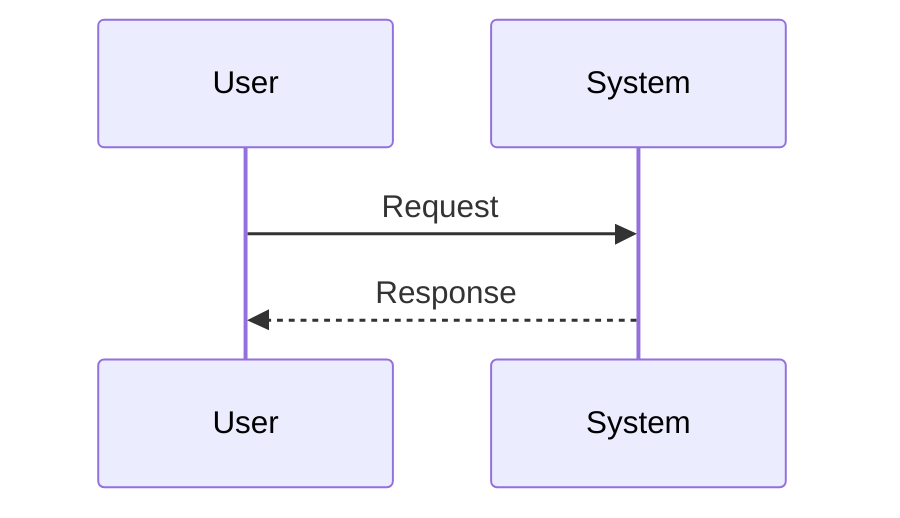
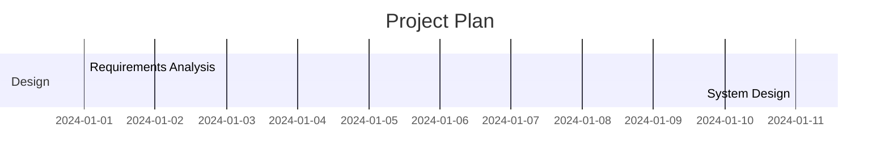
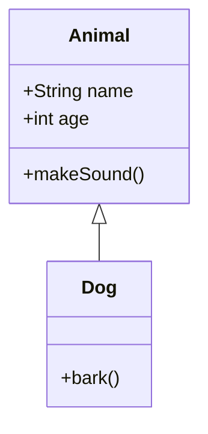
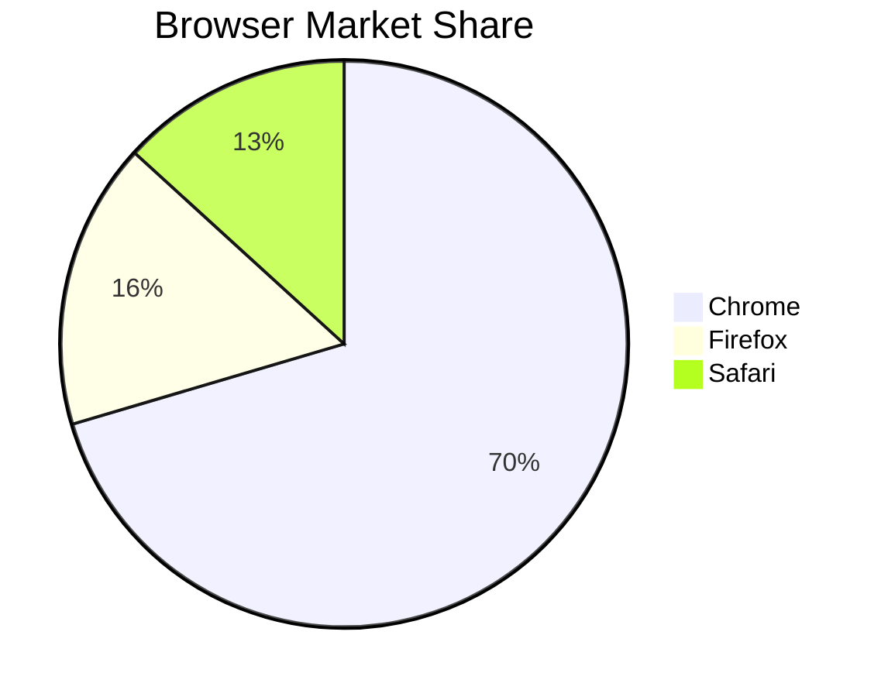
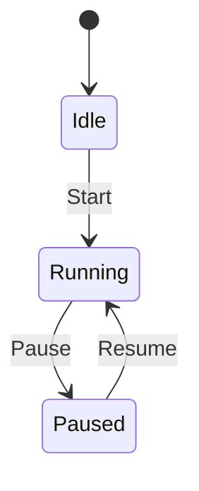
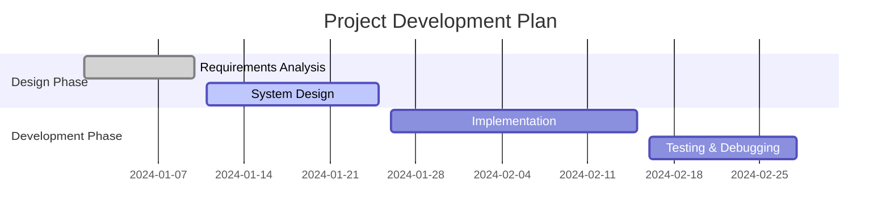

# React Markdown Mermaid

[中文文档](README.zh.md)

A lightweight component and rehype plugin to render Mermaid diagrams in React applications. It supports automatic rendering of `Mermaid` diagrams inside `react-markdown`, and can also be used as a standalone component.

**If you need a more feature-rich Mermaid rendering component, we recommend using [ds-markdown-mermaid-plugin](https://github.com/onshinpei/ds-markdown-mermaid-plugin).**

## 📦 Installation

```bash
npm install react-markdown-mermaid
# or
yarn add react-markdown-mermaid
# or
pnpm add react-markdown-mermaid
```

## 🚀 Quick Start

### 1. Integrate with react-markdown

````tsx
import React from 'react';
import ReactMarkdown from 'react-markdown';
import { rehypeMermaid, MermaidBlock } from 'react-markdown-mermaid';

const App = () => {
  const markdown = `
# My Document

Here is a flowchart:



Here is a sequence diagram:



`;

return (
<ReactMarkdown
  rehypePlugins={[
    [
      rehypeMermaid,
      {
        mermaidConfig: {
          theme: 'default',
          flowchart: { useMaxWidth: true },
        },
      },
    ],
  ]}
  components={{
      MermaidBlock: MermaidBlock,
    }} >
  {markdown}
</ReactMarkdown>
);
};

````

### 2. Basic Usage - Standalone Component

```tsx
import React from 'react';
import { Mermaid } from 'react-markdown-mermaid';

const App = () => {
  const chart = `
    graph TD
      A[Start] --> B{Condition}
      B -->|Yes| C[Handle A]
      B -->|No| D[Handle B]
      C --> E[End]
      D --> E
  `;

  return (
    <div>
      <h1>Flowchart Example</h1>
      <Mermaid code={chart} />
    </div>
  );
};
```

## 📚 API Reference

### Mermaid Component

Standalone Mermaid diagram component.

#### Props

| Property      | Type                     | Default                      | Description            |
| ------------- | ------------------------ | ---------------------------- | ---------------------- |
| `code`        | `string`                 | -                            | Mermaid diagram code   |
| `config`      | `MermaidConfig`          | -                            | Mermaid configuration  |
| `id`          | `string`                 | auto-generated               | Diagram ID             |
| `className`   | `string`                 | `'react-markdown-mermaid'`   | CSS class name         |
| `style`       | `CSSProperties`          | -                            | Inline styles          |
| `onLoad`      | `() => void`             | -                            | Callback when loaded   |
| `onError`     | `(error: Error) => void` | -                            | Error callback         |
| `onRender`    | `() => void`             | -                            | Callback when rendered |
| `showLoading` | `boolean`                | `true`                       | Show loading state     |
| `loadingText` | `string`                 | `'Loading diagram...'`       | Loading text           |
| `errorText`   | `string`                 | `'Failed to render diagram'` | Error text             |

#### Example

```tsx
import { Mermaid } from 'react-markdown-mermaid';

<Mermaid
  code={chartCode}
  config={{
    theme: 'dark',
    flowchart: { useMaxWidth: true },
  }}
  className="my-mermaid"
  onLoad={() => console.log('Diagram loaded')}
  onError={(error) => console.error('Render error:', error)}
/>;
```

### MermaidBlock Component

Component designed for the rehype plugin.

#### Props

| Property        | Type                     | Default                      | Description            |
| --------------- | ------------------------ | ---------------------------- | ---------------------- |
| `code`          | `string`                 | -                            | Mermaid diagram code   |
| `mermaidConfig` | `MermaidConfig`          | -                            | Mermaid configuration  |
| `id`            | `string`                 | auto-generated               | Diagram ID             |
| `className`     | `string`                 | `'mermaid-block'`            | CSS class name         |
| `style`         | `CSSProperties`          | -                            | Inline styles          |
| `onLoad`        | `() => void`             | -                            | Callback when loaded   |
| `onError`       | `(error: Error) => void` | -                            | Error callback         |
| `onRender`      | `() => void`             | -                            | Callback when rendered |
| `showLoading`   | `boolean`                | `true`                       | Show loading state     |
| `loadingText`   | `string`                 | `'Loading diagram...'`       | Loading text           |
| `errorText`     | `string`                 | `'Failed to render diagram'` | Error text             |

#### Example

```tsx
import { MermaidBlock } from 'react-markdown-mermaid';

<MermaidBlock
  code={chartCode}
  mermaidConfig={{
    theme: 'dark',
    flowchart: { useMaxWidth: true },
  }}
  className="my-mermaid-block"
  onLoad={() => console.log('Diagram loaded')}
  onError={(error) => console.error('Render error:', error)}
  onRender={() => console.log('Diagram rendered')}
  showLoading={true}
  loadingText="Rendering diagram..."
  errorText="Failed to render diagram"
/>;
```

### rehypeMermaid Plugin

Automatically handles Mermaid code blocks in `react-markdown`.

#### Options

| Property        | Type  | Default | Description           |
| --------------- | ----- | ------- | --------------------- |
| `mermaidConfig` | `any` | -       | Mermaid configuration |

## 🎨 Styling

### Import styles

```tsx
import 'react-markdown-mermaid/style.css';
```

### Customize styles

```css
/* Customize Mermaid component styles */
.react-markdown-mermaid {
  border: 1px solid #e1e5e9;
  border-radius: 8px;
  padding: 16px;
  margin: 16px 0;
}

/* Loading state */
.react-markdown-mermaid.loading {
  background-color: #f8f9fa;
}

/* Error state */
.react-markdown-mermaid.error {
  background-color: #f8d7da;
  color: #721c24;
}
```

## 📊 Supported Diagram Types

### 1. Flowchart

```
graph TD
  A[Start] --> B{Decision}
  B -->|Yes| C[Process]
  B -->|No| D[End]
```



### 2. Sequence Diagram

```
sequenceDiagram
  participant User
  participant System
  User->>System: Request
  System-->>User: Response
```



### 3. Gantt Chart



### 4. Class Diagram



### 5. Pie Chart



### 6. State Diagram



## 🔧 Advanced Configuration

### Mermaid Configuration

```tsx
const mermaidConfig = {
  theme: 'default', // or 'dark', 'forest', 'neutral'
  flowchart: {
    useMaxWidth: true,
    htmlLabels: true,
  },
  sequence: {
    useMaxWidth: true,
    diagramMarginX: 50,
    diagramMarginY: 10,
  },
  gantt: {
    useMaxWidth: true,
  },
};
```

### Error Handling

```tsx
<Mermaid
  code={chartCode}
  onError={(error) => {
    console.error('Mermaid render error:', error);
    // Show a friendly error message
  }}
  errorText="Failed to render diagram, please check the syntax"
/>
```

## 📝 Full Examples

### 1. Basic Example

```tsx
import React from 'react';
import { Mermaid } from 'react-markdown-mermaid';
import 'react-markdown-mermaid/style.css';

const BasicExample = () => {
  const flowchart = `
    graph TD
      A[Start] --> B{Condition}
      B -->|Yes| C[Handle A]
      B -->|No| D[Handle B]
      C --> E[End]
      D --> E
  `;

  const sequenceDiagram = `
    sequenceDiagram
      participant User
      participant System
      participant Database
      
      User->>System: Login request
      System->>Database: Verify user
      Database-->>System: Return result
      System-->>User: Login response
  `;

  return (
    <div>
      <h2>Flowchart</h2>
      <Mermaid code={flowchart} />

      <h2>Sequence Diagram</h2>
      <Mermaid code={sequenceDiagram} />
    </div>
  );
};
```

### 2. Markdown Integration Example

````tsx
import React from 'react';
import ReactMarkdown from 'react-markdown';
import remarkGfm from 'remark-gfm';
import { rehypeMermaid, MermaidBlock } from 'react-markdown-mermaid';
import 'react-markdown-mermaid/style.css';

const MarkdownExample = () => {
  const markdown = `
# Project Documentation

## System Architecture

```mermaid
graph TD
  A[Frontend] --> B[API Gateway]
  B --> C[User Service]
  B --> D[Order Service]
  C --> E[Database]
  D --> E
````

## User Login Flow

```mermaid
sequenceDiagram
  participant U as User
  participant F as Frontend
  participant A as API
  participant D as Database

  U->>F: Enter credentials
  F->>A: Send login request
  A->>D: Query user info
  D-->>A: Return user data
  A-->>F: Return login result
  F-->>U: Show login status
```

## Project Timeline



`;

return (
<ReactMarkdown
remarkPlugins={[remarkGfm]}
rehypePlugins={[
[
rehypeMermaid,
{
mermaidConfig: {
theme: 'default',
flowchart: { useMaxWidth: true },
sequence: { useMaxWidth: true },
gantt: { useMaxWidth: true },
},
},
],
]}
components={{
        MermaidBlock: MermaidBlock,
      }} >
{markdown}
</ReactMarkdown>
);
};

````

## 🤝 Contributing

Contributions via Issues and Pull Requests are welcome!

### Development Setup

```bash
# Clone the repository
git clone https://github.com/your-username/react-markdown-mermaid.git
cd react-markdown-mermaid

# Install dependencies
npm install

# Start the dev server
npm run dev

# Build the library
npm run build
````

## 📄 License

MIT License

## 🔗 Related Links

- [Mermaid Official Docs](https://mermaid.js.org/)
- [React Markdown](https://github.com/remarkjs/react-markdown)
- [Rehype](https://github.com/rehypejs/rehype)

---

If this library is helpful, please give it a ⭐️!

[](https://visitorbadge.io/status?path=https%3A%2F%2Fgithub.com%2Fonshinpei%2Freact-markddown-mermaid)
